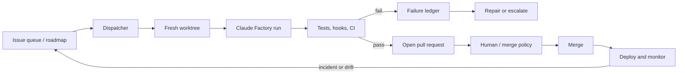

# Autonomous delivery

The interactive plugin is a harness. This layer runs it continuously — as a sequence of
short, resumable, evidence-producing jobs.

The design target is **continuous, bounded development**, not an unbounded agent running
forever. Do not run one Claude session for days with broad permissions: context drifts,
state becomes hard to recover, and a single mistaken assumption compounds.

## Operating model



Each task gets a fresh, bounded agent run:

1. dispatcher selects a ready issue;
2. creates an isolated worktree and branch;
3. starts Claude Code headlessly with `/factory`;
4. agent implements, tests, reviews, and opens a draft PR;
5. CI is the final deterministic gate;
6. a merger or human approves it;
7. failures become new queue items or factory-evolution work.

## Where state lives

**The issue is the queue.** Coarse state is a label; attempts, timestamps, cost, and the
last error live in one marked comment on the same issue, maintained by `runner/state.ts`.

Nothing durable lives in the workspace. CI checks the repository out fresh on every tick,
so a queue file written during one run is gone by the next — while the label it was
paired with persists. Two stores that disagree is how a crashed run ends up permanently
labelled `factory:claimed` with nothing able to see it. `.claude/factory/queue/` and
`.claude/factory/runs/` still exist, as caches for the current run only.

## Components

| File | Role |
|---|---|
| `runner/dispatcher.ts` | Claims exactly one `factory:ready` issue, validates its contract against the schema, records the claim on the issue |
| `runner/run-task.sh` | Fresh worktree, hard timeout, headless `claude -p`, path enforcement, draft PR |
| `runner/reconcile.ts` | Releases stale claims, escalates exhausted budgets — the only thing that moves a task backwards |
| `runner/state.ts` | Durable run state on the issue: attempts, claim time, cost, last error |
| `runner/paths.ts` | `allowed_paths`, `forbidden_paths`, and the harness guard — one implementation, shared by the runner and CI |
| `runner/config.ts` | Reads `factory.yaml` and enforces the autonomy ladder |
| `runner/task-schema.json` | The contract a task must satisfy to be claimable |
| `runner/*.test.ts` | The harness's own tests; `Factory CI / harness-tests` runs them |
| `skills/factory-repair/` | One bounded correction against concrete failure output |
| `skills/factory-open-pr/` | Draft PR carrying evidence, acceptance criteria, and rollback notes |
| `.github/workflows/factory-dispatch.yml` | Scheduler. Claims one task per tick. Holds no deploy credential |
| `.github/workflows/factory-ci.yml` | Deterministic gate, plus harness-integrity and weakened-test checks |
| `hooks/protect-harness.sh` | Blocks the agent from editing hooks, CI, runner, or its own quality gates |

## The task contract

The dispatcher only claims issues that carry a complete YAML contract in a fenced block,
labelled `factory:ready`. Anything vaguer is not claimable — see
`templates/queue/ENG-142.example.yaml` and `runner/task-schema.json`.

Required: `id`, `title`, `status: ready`, `owner`, `acceptance_criteria`, `allowed_paths`,
`risk`, `budget`. An `owner` is required because an escalation with no addressee is a
dropped escalation.

Every fenced yaml block in the body is considered, and the first one that satisfies the
schema wins. Issue templates routinely carry a sample above the real contract, and
claiming the sample would look legitimate all the way to the PR.

## The autonomy ladder is enforced, not advisory

`autonomy.level` in `factory.yaml` gates what the runner will do:

| Level | Grants |
|---|---|
| `off` | nothing runs autonomously |
| `pr_only` | a human may dispatch one named task |
| `repair` | adds one bounded repair attempt after a deterministic failure |
| `queue` | adds scheduled claiming from the `factory:ready` label |
| `automerge` | reserved for low-risk classes; **no runner code merges anything today** |

A missing or unreadable `factory.yaml` resolves to `off`. `max_open_factory_prs` is
enforced by the dispatcher, and a task's `max_cost_usd` is enforced after the run.

## Repair, not infinite retries

When a gate fails, the agent gets **one** bounded repair attempt against the actual failure
output. It may not change acceptance criteria, and may not delete, skip, quarantine, or weaken
a failing test. After `max_attempts`, the run stops and writes an escalation artifact
(`templates/escalation.example.yaml`).

The attempt is counted on the issue **before** the agent starts. An attempt that is only
counted on success is not a budget — a run that dies is free, and free retries are a loop.

A repair continues the existing `factory/<id>` branch rather than re-branching from the
base, so the repair skill can actually read the diff it is repairing. Escalation artifacts
are copied out of the worktree before it is destroyed and posted to the issue thread.

The goal is not "never ask a human." The goal is to only ask when an authority decision or
missing information is genuinely required.

## Permission model

| Action | Autonomous? |
|---|---|
| Read repository and issue | Yes |
| Create isolated branch/worktree | Yes |
| Edit scoped source and test files | Yes |
| Run local tests and static checks | Yes |
| Commit and push feature branch | Yes |
| Open a draft PR | Yes |
| Comment test evidence on the PR | Yes |
| Merge into protected branch | Usually no initially |
| Apply database migration | No |
| Deploy production | No |
| Change repository settings, secrets, permissions | No |

Three independent layers enforce the last rows, because one layer will eventually be bypassed:

1. `protect-harness.sh` blocks the edit at tool time;
2. `run-task.sh` refuses to push a branch that touched guarded paths;
3. `factory-ci.yml` fails the PR if guarded paths changed on a `factory/*` branch.

Layers 2 and 3 call `runner/paths.ts`, and `runner/paths.test.ts` fails if layer 1's list
drifts from it. Three layers that disagree read as defended while one quietly allows what
the others block.

Do not let the running agent alter its own safety hooks, merge policy, or deployment
permissions. Those changes require a separately reviewed PR.

### Why the headless run bypasses permission prompts

A prompt cannot be answered in a headless run, so an agent with interactive permissions
denies every tool and produces an empty branch. `run-task.sh` therefore runs with
`--permission-mode bypassPermissions`, and that is only defensible because the boundary is
enforced outside the agent: hooks at tool time, `allowed_paths` after the run, CI on the
PR, an ephemeral container, and a token with no deploy authority. The script **refuses to
start** in that mode if `.claude/hooks/` and `.claude/settings.json` are not present,
because without them the argument does not hold. Override with `FACTORY_PERMISSION_MODE`.

## Rollout

1. **Week 1 — PR-only.** `autonomy.level: pr_only`. One task at a time, draft PR, no merges. Watch failure modes.
2. **Week 2 — CI repair.** `level: repair`. One repair attempt after a deterministic failure.
3. **Week 3 — queue integration.** `level: queue`. Claim only issues with explicit acceptance criteria and a `factory:ready` label.
4. **Week 4 — low-risk auto-merge.** `level: automerge`, restricted to `auto_merge_allowed_classes` with protected-branch checks. No runner code performs a merge today; adding it is a deliberate, separately reviewed change.
5. **Later — deploy automation.** Canary-only, with independent monitoring and automatic rollback. Not direct production release authority.

## What the factory learns from

- failed CI → repair task or failure ledger entry;
- review-requested changes → candidate skill or `CLAUDE.md` improvement;
- production incident → regression test plus `/factory-evolve`;
- repeated human edit after agent PRs → update the relevant workflow;
- successful repeated pattern across repositories → versioned plugin capability.

The ledger is written by `hooks/capture-failure.sh` on `PostToolUseFailure` and
`PostToolUse`, recording the tool, the invocation, and the actual error text. An entry saying
only that something failed is not evidence anyone can evolve from.

`PostToolUse` fires only after a call succeeds, so `PostToolUseFailure` is the registration
that makes the ledger fill at all; `PostToolUse` catches tools that report an error in-band
while the call itself succeeds.

## Setup

### Credentials

The runner needs one of two, not both:

```bash
# Claude subscription (no API key required). Run this where you are already
# signed in, then store the printed token as the CLAUDE_CODE_OAUTH_TOKEN secret.
claude setup-token
```

`CLAUDE_CODE_OAUTH_TOKEN` bills against your Claude subscription and **shares its rate
limits with your interactive sessions** — a factory claiming a task every 30 minutes
competes with your own work for the same capacity. That is the main argument for the
alternative, `ANTHROPIC_API_KEY`, which is pay-per-token against a separate quota. Start
on the subscription token; move to an API key when contention becomes the constraint.

`run-task.sh` refuses to start in CI when neither is set, rather than provisioning a
worktree and failing at the first model call.

```bash
# repository secrets — set one
CLAUDE_CODE_OAUTH_TOKEN   # subscription auth, from `claude setup-token`
ANTHROPIC_API_KEY         # or pay-per-token API billing

# repository variables (optional)
FACTORY_PLUGIN_REF   # where CI installs the claude-factory plugin from

# labels
gh label create factory:ready        --description "Claimable by the factory"
gh label create factory:claimed      --description "A factory run holds this task"
gh label create factory:needs-review --description "Run produced a branch; human should look"
gh label create factory:blocked      --description "Escalated to a human"
```

Set `.claude/factory/factory.yaml` → `commands` to real values first. `factory-ci.yml` warns
on any gate still marked `TODO`; a gate that is not wired up must fail loudly, never pass silently.

Protect `main`: require `Factory CI / gates`, `Factory CI / harness-tests`, and
`Factory CI / harness-integrity`, and require a review on `factory/*` branches until PR
quality is consistently high.
